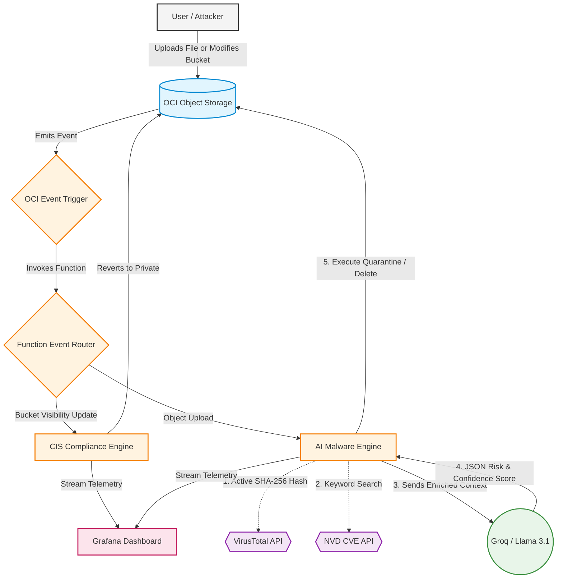
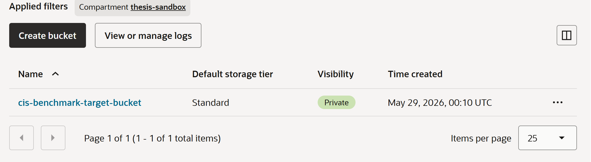
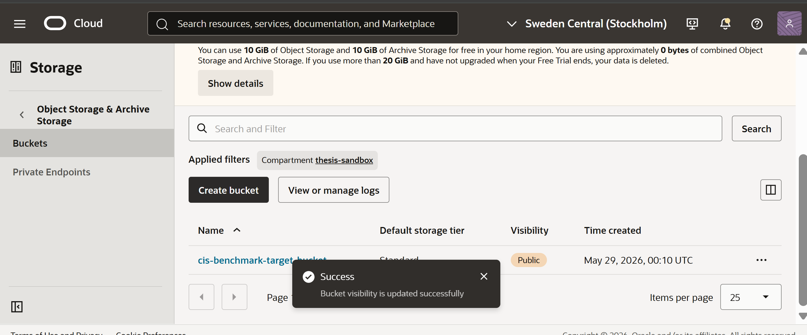
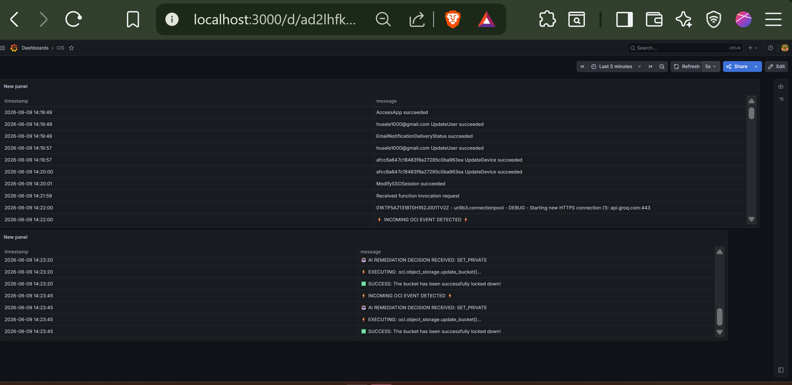
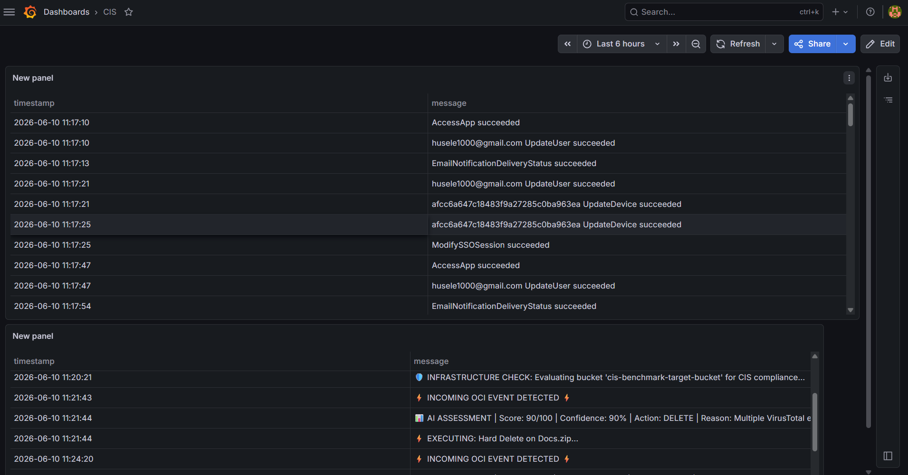

# 🛡️ Autonomous AI Security Remediation Engine

[](https://www.python.org/)
[](https://cloud.oracle.com/)
[](https://groq.com/)

> **Academic Thesis Project:** An event-driven, serverless cloud security engine that uses Large Language Models (LLMs) and Threat Intelligence to autonomously detect, evaluate, and remediate cloud infrastructure threats and malware in milliseconds.

## 📖 Overview

Modern cloud environments generate thousands of alerts daily, creating severe alert fatigue for Security Operations Center (SOC) analysts. This project demonstrates a zero-trust, automated remediation pipeline deployed on Oracle Cloud Infrastructure (OCI).

By hooking real-time OCI Event streams into a serverless Python function powered by Llama 3.1 (via the Groq API), the system features a **Dual-Engine Architecture**:

1. **Infrastructure Compliance Engine:** Deterministically monitors bucket configurations, instantly reverting unauthorized public exposure to enforce CIS Benchmarks.
2. **AI Malware Engine:** Autonomously intercepts uploaded files, calculates active SHA-256 hashes, enriches data via VirusTotal and NVD (CVEs), and uses an LLM to mathematically score risk—triggering ALLOW, QUARANTINE, or DELETE actions based on AI confidence levels.

## 🏗️ Architecture Workflow



## 🔄 Process Breakdown

### Event Routing

OCI Events wake the function. A router filters out system noise and directs the payload to the appropriate engine.

### Infrastructure Defense

If a bucket is made public, the function uses the OCI SDK to instantly rewrite the IAM visibility back to **Private**.

### Threat Enrichment

For file uploads, the function streams the payload into memory to calculate a true SHA-256 hash, bypassing OCI's native multipart eTag flaws. It queries VirusTotal and the US Government NVD for known threats.

### AI Evaluation

Llama 3.1 evaluates the enriched context using strict **Deterministic Anchoring** rules to prevent LLM semantic bias, returning a parsed JSON Risk Score and Confidence Level.

### Fail-Safe Remediation

If the risk is critical but AI confidence is low, the system safely downgrades a DELETE action to QUARANTINE (renaming to `.locked`) to prevent false-positive data destruction.

## 🚀 Prerequisites

To deploy this architecture, you will need:

* An Oracle Cloud Infrastructure (OCI) account with Administrator privileges.
* A locally configured OCI CLI and Fn Project CLI.
* A Groq API Key for Llama 3.1 inference.
* A VirusTotal API Key for threat intelligence.
* A Grafana instance connected to OCI Logging Analytics.

## 🤖 Processes and Screenshots





## 🛠️ Deployment Guide

### 1. Configure IAM Policies

The function requires strict Identity and Access Management (IAM) clearance to operate autonomously. Create a Dynamic Group with the specific OCID of your function:

```text
ALL {resource.id = 'ocid1.fnfunc.oc1...'}
```

Grant the Dynamic Group permission to manage Object Storage:

```text
Allow dynamic-group thesis-function-group to manage object-family in tenancy
```

### 2. Deploy the Serverless Function

Initialize the deployment to your OCI container registry:

```bash
fn deploy --app thesis-app
```

### 3. Inject External API Brains

Pass your API keys securely into the function's environment variables:

```bash
fn config app thesis-app GROQ_API_KEY "gsk_your_groq_key"
fn config app thesis-app VT_API_KEY "your_virustotal_key"
```

## 🧠 Technical Challenges Solved (Methodology)

### LLM Semantic Bias (Gullibility)

Implemented **Deterministic Anchoring** in the system prompt to force the LLM to penalize executable extensions mathematically, preventing attackers from bypassing security by naming malware `docs.exe`.

### Multipart Upload Hash Flaws

Bypassed inaccurate OCI eTag metadata by utilizing Python's `hashlib` to actively stream and calculate true SHA-256 cryptographic hashes in-memory for VirusTotal validation.

### False-Positive Mitigation

Transitioned from a binary **ALLOW/DELETE** model to a 3-tier **ALLOW/QUARANTINE/DELETE** pipeline utilizing an LLM Confidence Score fail-safe.

### IAM Cache Propagation

Mitigated the 3–5 minute global replication delay when applying tenancy-wide Dynamic Group policies.

### URL Double-Encoding

Implemented `urllib.parse.unquote()` to prevent OCI SDK `404 BucketNotFound` errors when processing file names containing spaces.

## 📝 License & Acknowledgments

Developed as part of a Master's Thesis on Cloud Security and AI Automation.

Powered by Oracle Cloud Infrastructure and Groq.
