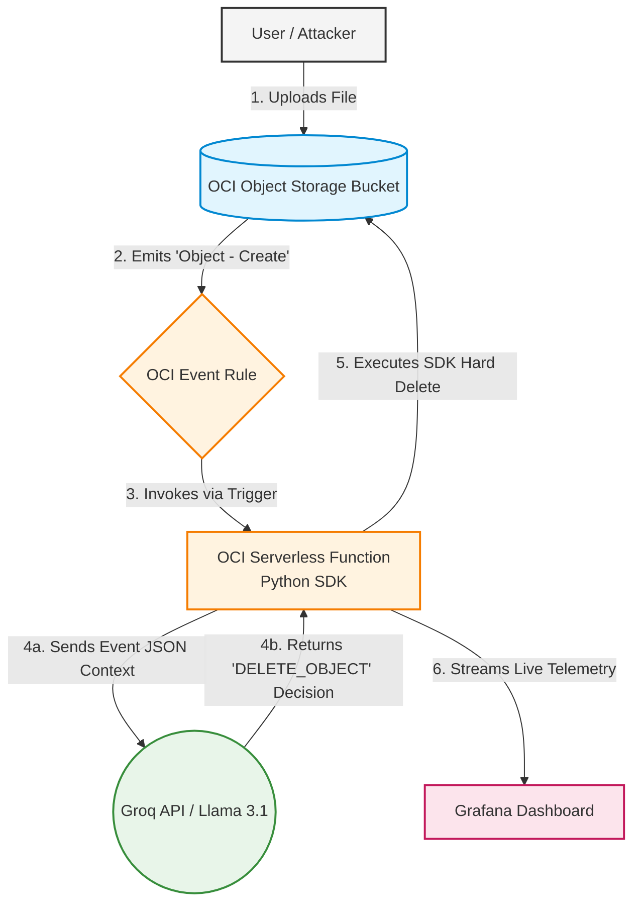

Markdown
# 🛡️ Autonomous AI Security Remediation Engine

[](https://www.python.org/)
[](https://cloud.oracle.com/)
[](https://groq.com/)

> **Academic Thesis Project:** An event-driven, serverless cloud security engine that uses Large Language Models (LLMs) to autonomously detect, evaluate, and remediate cloud infrastructure threats in milliseconds.

## 📖 Overview

Modern cloud environments generate thousands of alerts daily, creating severe alert fatigue for Security Operations Center (SOC) analysts. This project demonstrates a zero-trust, automated remediation pipeline deployed on Oracle Cloud Infrastructure (OCI). 

By hooking real-time OCI Event streams into a serverless Python function powered by Llama 3.1 (via the Groq API), the system autonomously intercepts uploaded files, evaluates them against security heuristics, and vaporizes malware before it can be executed—all without human intervention.

## 🏗️ Architecture Workflow

1. **Detection (OCI Events):** A cloud bucket is monitored for `Object - Create` events.
2. **Trigger (OCI Functions):** An event fires, instantly waking up a sterile, serverless Docker container running the Python security payload.
3. **Evaluation (Groq / Llama 3.1):** The function parses the event JSON and sends the payload context to Llama 3.1, asking for a binary security decision (`ALLOW` or `DELETE_OBJECT`).
4. **Remediation (OCI Python SDK):** If deemed a threat, the function utilizes a tenancy-wide IAM Dynamic Group badge to execute a hard delete on the malicious object.
5. **Observability (Grafana):** Every microsecond of the decision-making process is logged and visualized in a live Grafana dashboard.

## 🚀 Prerequisites

To deploy this architecture, you will need:
* An **Oracle Cloud Infrastructure (OCI)** account with Administrator privileges.
* A locally configured OCI CLI and Fn Project CLI.
* A **Groq API Key** for LLM inference.
* A **Grafana** instance connected to OCI Logging Analytics.
## 🤖 Processes and Screenshots
(Just before changing the Visibility)[docs/before-1.png]
## 🛠️ Deployment Guide

### 1. Configure IAM Policies
The function requires strict Identity and Access Management (IAM) clearance to operate autonomously. Create a Dynamic Group with the specific OCID of your function:
```
ALL {resource.id = 'ocid1.fnfunc.oc1...'}
# Grant the Dynamic Group the "Master Key" to manage object storage:
# Allow dynamic-group thesis-function-group to manage object-family in tenancy
```
## 2. Deploy the Serverless Function
Initialize the deployment to your OCI container registry:

```bash
fn deploy --app thesis-app
```
## 3. Inject the AI Brain
Pass your Groq API key securely into the function's environment variables (do not hardcode this in your script!):

```bash
fn config app thesis-app GROQ_API_KEY "gsk_your_api_key_here"
```
## 🧠 Technical Challenges Solved (Methodology)
Building a fully autonomous system required navigating several complex cloud mechanics:

IAM Cache Propagation: Mitigating the 3-5 minute global server replication delay when applying tenancy-wide Dynamic Group policies.

URL Double-Encoding: Implementing urllib.parse.unquote() to prevent OCI SDK 404 BucketNotFound errors when processing file names containing spaces (e.g., %20).

Sterile Container Authentication: Bypassing standard local environment variables by injecting API keys directly into the OCI Application configuration to resolve 401 Unauthorized API drops.
## 📝 License & Acknowledgments
Developed as part of a Master's Thesis on Cloud Security and AI Automation.

Powered by Oracle Cloud Infrastructure and Groq.


## How to push this to GitHub:
If you want to add this right now without leaving your terminal, just save that text into a file called `README.md`, and then run the standard Git trio:
- `git add README.md`
- `git commit -m "docs: add comprehensive README for thesis project"`
- `git push origin main`
